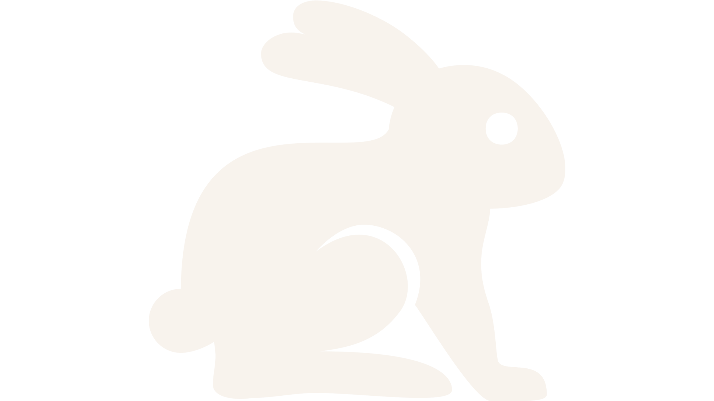

  

<h3 align="center">GitHub Stats</h3>

<table align="center" width="100%">
<tr>
<td width="5%"></td>
<td align="center" width="44%">
  <picture>
    <source media="(prefers-color-scheme: dark)" srcset="https://github-readme-stats.vercel.app/api?username=WhiteRabbitCoder&show_icons=true&count_private=true&rank_icon=github&bg_color=0d1117&title_color=9a8ec4&text_color=cdcfe0&icon_color=9a8ec4&border_color=3d444d" />
    <source media="(prefers-color-scheme: light)" srcset="https://github-readme-stats.vercel.app/api?username=WhiteRabbitCoder&show_icons=true&count_private=true&rank_icon=github&bg_color=ffffff&title_color=c49a6c&text_color=3d2c1a&icon_color=c49a6c&border_color=d0d7de" />
    
  </picture>
</td>
<td width="2%"></td>
<td align="center" width="44%">
  <picture>
    <source media="(prefers-color-scheme: dark)" srcset="https://github-readme-stats.vercel.app/api/top-langs/?username=WhiteRabbitCoder&layout=compact&langs_count=8&bg_color=0d1117&title_color=9a8ec4&text_color=cdcfe0&icon_color=9a8ec4&border_color=3d444d" />
    <source media="(prefers-color-scheme: light)" srcset="https://github-readme-stats.vercel.app/api/top-langs/?username=WhiteRabbitCoder&layout=compact&langs_count=8&bg_color=ffffff&title_color=c49a6c&text_color=3d2c1a&icon_color=c49a6c&border_color=d0d7de" />
    
  </picture>
</td>
<td width="5%"></td>
</tr>
<tr>
<td></td>
<td align="center" colspan="3">
  <picture>
    <source media="(prefers-color-scheme: dark)" srcset="https://github-readme-streak-stats.herokuapp.com/?user=WhiteRabbitCoder&background=0d1117&border=3d444d&stroke=3d444d&ring=9a8ec4&fire=9a8ec4&currStreakNum=cdcfe0&currStreakLabel=9a8ec4&sideNums=cdcfe0&sideLabels=6e7491&dates=6e7491" />
    <source media="(prefers-color-scheme: light)" srcset="https://github-readme-streak-stats.herokuapp.com/?user=WhiteRabbitCoder&background=ffffff&border=d0d7de&stroke=d0d7de&ring=c49a6c&fire=c49a6c&currStreakNum=3d2c1a&currStreakLabel=c49a6c&sideNums=3d2c1a&sideLabels=8b7355&dates=8b7355" />
    
  </picture>
</td>
<td></td>
</tr>
</table>

<h3>Let's Connect</h3>

  <a href="https://www.linkedin.com/in/gaviria-marin/"><picture>
    <source media="(prefers-color-scheme: dark)" srcset="https://img.shields.io/badge/LinkedIn-9a8ec4?style=for-the-badge&logo=linkedin&logoColor=0d1117" />
    <source media="(prefers-color-scheme: light)" srcset="https://img.shields.io/badge/LinkedIn-c49a6c?style=for-the-badge&logo=linkedin&logoColor=ffffff" />
    
  </picture></a>
  <a href="mailto:angelogaviriam@gmail.com"><picture>
    <source media="(prefers-color-scheme: dark)" srcset="https://img.shields.io/badge/Gmail-9a8ec4?style=for-the-badge&logo=gmail&logoColor=0d1117" />
    <source media="(prefers-color-scheme: light)" srcset="https://img.shields.io/badge/Gmail-c49a6c?style=for-the-badge&logo=gmail&logoColor=ffffff" />
    
  </picture></a>
  <a href="https://github.com/WhiteRabbitCoder"><picture>
    <source media="(prefers-color-scheme: dark)" srcset="https://img.shields.io/badge/GitHub-9a8ec4?style=for-the-badge&logo=github&logoColor=0d1117" />
    <source media="(prefers-color-scheme: light)" srcset="https://img.shields.io/badge/GitHub-c49a6c?style=for-the-badge&logo=github&logoColor=ffffff" />
    
  </picture></a>

 

<!-- WhiteRabbitCoder signature -->
<picture>
  <source media="(prefers-color-scheme: dark)" srcset="./assets/rabbit-dark.png" />
  <source media="(prefers-color-scheme: light)" srcset="./assets/rabbit-light.png" />
  
</picture>

